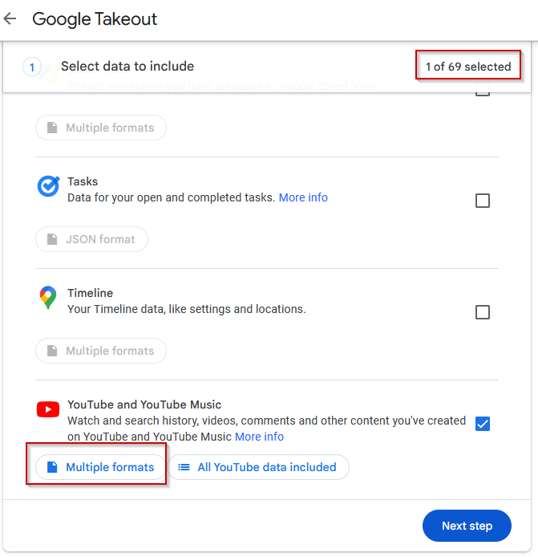
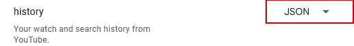

# Table of Contents

# Project Setup

## Getting YouTube Music data from Google Takeout
1. Navigate to [Google Takeout](https://takeout.google.com/)
2. Create a new export
    1. Select YouTube and YouTube Music (ensure all other options are deselected)
        
    2. Click `Multiple formats` and change `history` to `JSON`, click `OK`
        
3. Click `Next Step`, select file delivery options then click `Create export`
4. Once export is created, download zip file and extract
5. Locate `watch-history.json` and add it to the `/data` within this project
    1. NOTE: `watch-history.json` contains YOUR personal data, this project is designed to ignore files with that name, but git will track it should you include that file then change the name.
    2. `watch-history.json` can be found here in extracted file: `Takeout-20250312T231919Z-001.zip\Takeout\YouTube and YouTube Music\history`

## Execute cmd to clean data